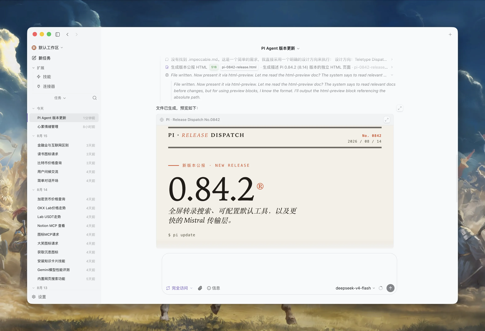
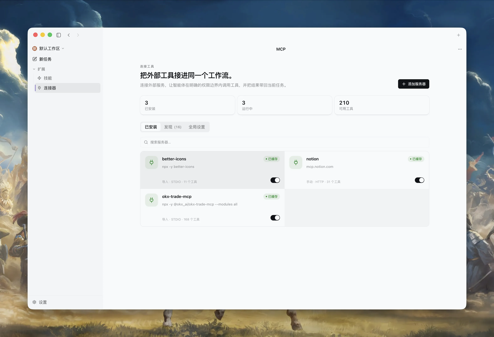
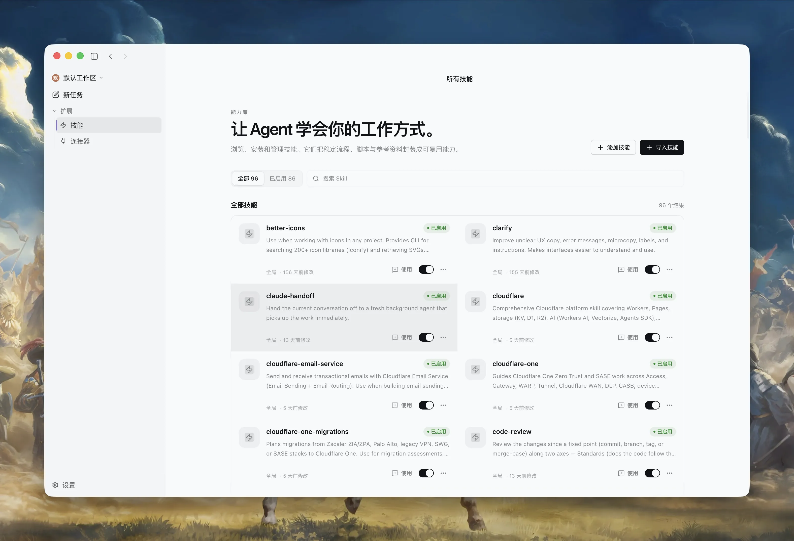

<p align="center">
  
</p>

<h1 align="center">Bitlab</h1>

<p align="center">
  A local-first, Pi-powered AI agent workspace for Desktop and WebUI.
</p>

<p align="center">
  <a href="https://github.com/limboinf/bitlab-agent/releases/latest"></a>
  <a href="./LICENSE"></a>
  <a href="https://bun.sh"></a>
  <a href="https://www.electronjs.org"></a>
</p>

<p align="center">
  <a href="https://github.com/limboinf/bitlab-agent/releases/latest">Download</a> ·
  <a href="./docs/README.md">Documentation</a> ·
  <a href="./docs/zh/README.md">中文文档</a> ·
  <a href="#build-from-source">Build from source</a>
</p>

Bitlab is an open-source, local-first AI agent workspace for anyone who wants more control over
their AI work. Download and use it through Desktop or WebUI, or extend its open-source
foundation to build your own desktop agent product. Powered by the
[Pi](https://github.com/badlogic/pi-mono) agent runtime, it combines persistent local workspaces,
model flexibility, browser tools, and document tools in one application.
Application state stays under your local data directory, and credentials are stored through the
operating system credential manager.

## See Bitlab in action

### Turn conversations into working artifacts

Follow the agent's progress, inspect file operations, and preview finished results directly inside
the session.

<p align="center">
  
</p>

<table>
  <tr>
    <td width="50%" valign="top">
      
      <br /><strong>Connect external tools</strong><br />Manage MCP servers, available tools, and connection status from one workspace.
    </td>
    <td width="50%" valign="top">
      
      <br /><strong>Reuse the way you work</strong><br />Browse and enable Skills that package instructions, scripts, and references.
    </td>
  </tr>
</table>

## Features

- **Local-first workspaces** — keep sessions, files, settings, and workspace history on your machine.
- **Flexible model connections** — sign in with ChatGPT Plus, use API keys for providers such as
  OpenAI or Anthropic (Claude), connect compatible endpoints, or run local Ollama models.
- **Desktop and WebUI** — work through the Electron app or a browser-based renderer backed by an RPC
  command-line client backed by the same runtime.
- **Agent workflows** — create and branch sessions, build plans, use Skills, resume work, manage
  follow-ups, and run multiple windows.
- **Built-in tools** — browse the web, work with attachments, render Markdown and code, and inspect
  or transform common document formats.
- **Explicit control** — choose Explore, Ask, or Execute permission modes, configure a network
  proxy, and switch between English and Simplified Chinese.

## Download

Every release publishes installers for all three interfaces on the
[Releases page](https://github.com/limboinf/bitlab-agent/releases/latest).

| Platform | File | Notes |
| --- | --- | --- |
| macOS (Apple Silicon) | `Bitlab-<version>-arm64.dmg` | M1 and later |
| macOS (Intel) | `Bitlab-<version>-x64.dmg` | |
| Windows x64 | `Bitlab-<version>-x64.exe` | per-user install, no administrator rights required |
| Linux x64 | `Bitlab-<version>-x86_64.AppImage` | `chmod +x` then run |
| Headless server | `Bitlab-server-<version>-<platform>-<arch>.tar.gz` / `.zip` | serves the WebUI and the RPC API |

Every release also ships `SHA256SUMS`. Verify a download before running it:

```bash
shasum -a 256 -c SHA256SUMS --ignore-missing
```

### First launch on an unsigned build

Signing certificates are optional for this project, and a release built without
them is packaged ad-hoc on macOS and unsigned on Windows. Check `SIGNING_STATUS.txt`
in the release assets for the trust status of the version you downloaded.

**macOS** refuses ad-hoc-signed apps with "Bitlab is damaged and can't be opened".
The quarantine attribute is the cause, not a corrupted download:

```bash
xattr -dr com.apple.quarantine /Applications/Bitlab.app
```

**Windows** SmartScreen: choose **More info** → **Run anyway**.

Maintainers configuring signing should read [code-signing.md](./docs/code-signing.md).

## Tech Stack

- [Bun](https://bun.sh) — Workspace runtime, package manager, scripts, and tests.
- [Electron](https://www.electronjs.org) — Cross-platform desktop application shell.
- [React](https://react.dev/) and [TypeScript](https://www.typescriptlang.org/) — Shared user
  interface and typed application code.
- [Vite](https://vite.dev/) and [Tailwind CSS](https://tailwindcss.com/) — Renderer tooling and styling.
- [Pi](https://github.com/badlogic/pi-mono) — Agent runtime, model providers, sessions, and tool execution.

## Interfaces

| Interface | Best for | Command |
| --- | --- | --- |
| Desktop | Full local experience and browser pane | `bun run electron:dev` |
| WebUI | Browser access to the headless server | `bun run server:prod` |

## Build from source

### Prerequisites

- [Bun](https://bun.sh) 1.3.14 or later
- Node.js 18 or later
- Git
- Python 3.12 and [`uv`](https://docs.astral.sh/uv/) for the complete document-tool test suite

### Run the Desktop app

```bash
git clone https://github.com/limboinf/bitlab-agent.git
cd bitlab-agent
bun install --frozen-lockfile
bun run electron:dev
```

Bitlab creates its default workspace at `~/.bitlab/workspaces/default`. The configuration root can
be isolated for development or testing with `BITLAB_CONFIG_DIR=/path/to/directory`.

### Common commands

| Command | Description |
| --- | --- |
| `bun run electron:dev` | Start the Electron development environment |
| `bun run electron:start` | Build and launch Electron once |
| `bun run server:prod` | Build and start the headless server with WebUI |
| `bun run test` | Run unit and isolated tests |
| `bun run validate:ci` | Run the full type, test, document-tool, and localization gate |

More commands and environment variables are documented in the
[development guide](./docs/development.md).

## Architecture

Bitlab is a Bun workspace with a shared runtime and renderer across its three interfaces:

```text
apps/
  electron/              Electron main, preload, renderer, and Browser pane
  webui/                 Browser adapter for the shared renderer
  cli/                   RPC command-line client
packages/
  core/                  Stable DTOs, events, and error contracts
  shared/                Configuration, credentials, prompts, Skills, theme, and i18n
  ui/                    Shared React UI and content renderers
  server-core/           RPC transport, sessions, and runtime orchestration
  server/                Headless server
  pi-agent-server/       Pi agent subprocess
  session-tools-core/    Plans, Skills, browser, and session tools
```

Read the [architecture guide](./docs/architecture.md) for runtime boundaries, process ownership, and
data flow.

## Documentation

The complete documentation is available in [English](./docs/README.md) and
[Simplified Chinese](./docs/zh/README.md).

| Area | Guides |
| --- | --- |
| Start here | [Development](./docs/development.md), [architecture](./docs/architecture.md), [testing](./docs/testing.md) |
| Models | [Connections](./docs/connections.md), [Ollama](./docs/ollama.md) |
| Work | [Sessions](./docs/sessions.md), [Skills](./docs/skills.md) |
| Tools | [Browser](./docs/browser.md), [attachments](./docs/attachments.md), [document tools](./docs/document-tools.md) |
| Runtime | [permissions](./docs/permissions.md), [network proxy](./docs/network-proxy.md) |
| Project | [features](./docs/featues.md), [releases](./docs/releases.md), [code signing](./docs/code-signing.md), [upstream synchronization](./docs/upstream-sync.md) |
| Contributing | [CONTRIBUTING.md](./CONTRIBUTING.md), [SECURITY.md](./SECURITY.md), [CHANGELOG.md](./CHANGELOG.md) |

## Project lineage

Bitlab started from selected architecture and code in
[Craft Agents OSS](https://github.com/craft-ai-agents/craft-agents-oss) `v0.11.2`
(`a60ebc1a5a7c`) and continues with an independent Git history and product boundary. Bitlab is not
affiliated with or endorsed by the upstream project. See [NOTICE](./NOTICE) for attribution and the
[comparison guide](./docs/comparison-with-craft.md) for the current differences.

## License

Licensed under the [Apache License 2.0](./LICENSE). You may use, modify, and distribute the code,
including for commercial purposes, subject to the license terms.
