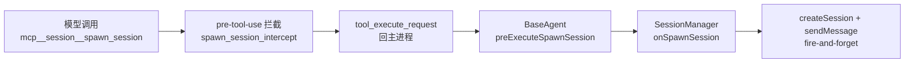
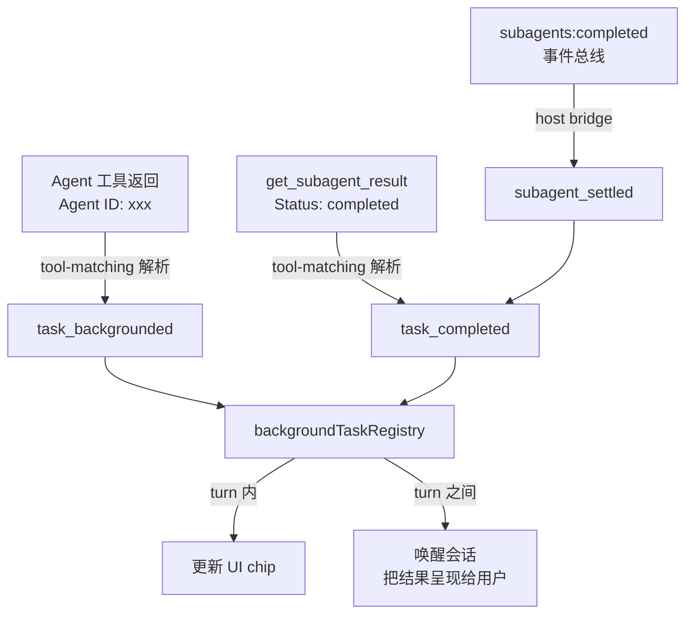

# 子 Agent 与多 Agent

Bitlab 有两套让 agent 把活分出去的机制，它们的进程模型、生命周期和 UI 呈现都不一样，用途也不该混。本文记录两者的实现链路、彼此的边界，以及接入过程中暴露的几个根因相同的缺陷。

## 1. 一句话区分

- **多 Agent（`spawn_session`）** — 创建一个**平级的独立会话**。它出现在侧栏，用户可以点进去接管对话，父会话关了它照样活。适合有自己生命周期的工作。
- **子 Agent（`Agent` 工具）** — 在**当前 turn 内**跑一个受控的子 agent，结果作为 tool result 回填给父 agent。不进侧栏，用户不直接对话。适合本轮就要用到结论的子任务。

| | 多 Agent | 子 Agent |
| --- | --- | --- |
| 工具 | `spawn_session`（Bitlab 自研） | `Agent` / `get_subagent_result` / `steer_subagent`（`@tintinweb/pi-subagents` 扩展） |
| 运行位置 | 新建的独立 session | 父会话子进程内的独立 Pi session |
| 生命周期 | 永久，与父会话无关 | 前台模式绑定当前 turn；后台模式可跨 turn |
| 上下文 | 全新，零共享 | 全新（可选 `inherit_context`），共享 cwd |
| UI | 侧栏多一行 | turn 卡片里一行带徽标的活动 |
| 用户可否插话 | 可以，就是普通会话 | 不可以（可用 `steer_subagent` 由 agent 转达） |
| 结果回传 | `send_agent_message` 主动推 | tool result 直接回填 |

还有一个更轻的选项：`call_llm` 是单次补全，无工具、无多轮，适合处理你已经拿到的内容。三者的取舍写在系统提示里（[`system.ts`](../../packages/shared/src/prompts/system.ts) 的 “Three ways to hand work off”）。

## 2. 多 Agent：`spawn_session`

### 2.1 链路



工具在 [`tool-defs.ts:199`](../../packages/session-tools-core/src/tool-defs.ts) 声明为 `executionMode: 'backend'`、`safeMode: 'block'`（安全模式下禁用），带 `mcp__session__` 前缀注册进子进程。这个前缀只是命名空间约定，不是 MCP 协议——它让权限规则能按前缀整体匹配，也让不同后端共用同一套工具名。

真正落地在 [`SessionManager.ts:1277`](../../packages/server-core/src/sessions/SessionManager.ts) 的 `onSpawnSession`：调 `createSession` 建一条真会话（记下 `parentSessionId`），再 `void sendMessage(...)` 把 prompt 推进去，不等结果。

### 2.2 会话之间怎么通信

`parentSessionId` **只是血缘记录**，没有任何一处基于它做级联、查询或通知。两条会话在数据层面是平级的。可用的通道只有两条：

1. **共享文件系统** — 同一 workspace 下 cwd 相同，约定一个产出目录即可。
2. **`send_agent_message`** — 把消息当成一条用户输入塞进目标会话：对方空闲就立刻起一个 turn，正忙就排队等本轮结束（[`SessionManager.ts:1377`](../../packages/server-core/src/sessions/SessionManager.ts)）。

第 2 条要能用，前提是双方都知道对方的 session id。父到子没问题（`spawn_session` 的返回值里有），子到父则需要显式告知——所以 spawn 时会自动在 prompt 前包一层信封。

### 2.3 信封与消息气泡

[`agent-envelope.ts`](../../packages/server-core/src/sessions/agent-envelope.ts) 统一构造两种信封，各自产出 `{ content, badge }`：

- `buildSpawnedSessionPrompt` — 派生会话的开场白，告诉它是谁派来的、怎么回报。
- `buildInboundAgentMessage` — `send_agent_message` 送达的消息头。

信封会给出**确切的回复调用**（借鉴 pi-intercom 的 `replyHint` 思路），让回复零猜测成本。若子会话运行在安全模式（`send_agent_message` 被 block），信封改为提示写文件，不给它一个够不着的工具。

`badge` 是 `type: 'agent'` 的 `ContentBadge`，覆盖信封头部区间。模型收到完整文本，而 UI 把这段折叠成一个 “来自 X” 的 chip——[`user-message-badges.ts`](../../packages/ui/src/components/chat/user-message-badges.ts) 负责剥离，气泡改用描边样式表示“这不是我发的”。

> 副作用一处：会话 fallback 标题取自第一条用户消息。agent badge 覆盖的区间会先被切掉，否则每个派生会话都会叫 `[Spawned by session …]`。

## 3. 子 Agent：pi-subagents 扩展

### 3.1 为什么是扩展注入

Pi SDK **本身没有子 agent 工具**，内置工具只有 `bash / edit / find / grep / ls / read / write` 七个。子 agent 能力来自第三方 Pi 扩展 [`@tintinweb/pi-subagents`](https://github.com/tintinweb/pi-subagents)（固定 `0.17.1`，其 peer 要求 `>=0.80.0`，与项目锁定的 SDK 版本兼容）。

它的入口是 `export default function (pi: ExtensionAPI)`，与 pi-mcp-adapter 同形，因此复用现成的 inline extension 通道注入（[`subagents-extension.ts`](../../packages/pi-agent-server/src/subagents-extension.ts)）。

之所以必须显式注入：子进程的 `agentDir` 被隔离到每会话临时目录，刻意不加载 `~/.pi/agent` 下的用户扩展——这层隔离同时挡住了打包扩展，所以凡是 Bitlab 要带的都得手动塞进去。

`BitlabResourceLoader` 接受 `inlineExtensions: InlineExtension[]`，MCP adapter、MCP host bridge、子 agent 扩展、子 agent 完成桥都走这一个口子。

### 3.2 工具白名单陷阱

非 MCP 场景下 Bitlab 会给 `createAgentSession` 传 `tools` 名字白名单。**扩展注册的工具是在 session 建好之后才加入的**，静态白名单不可能包含它们，`_refreshToolRegistry` 会把它们全部静默过滤掉。

实测对照：

```
不传白名单: ["read","bash","edit","write","Agent","get_subagent_result","steer_subagent"]
传白名单:   ["read","bash","edit","write"]        ← 三个工具消失
```

因此启用子 agent 时与 MCP 同样省略白名单（[`index.ts:846`](../../packages/pi-agent-server/src/index.ts)）。这条行为由 [`subagents-extension.test.ts`](../../packages/pi-agent-server/src/subagents-extension.test.ts) 的两个用例锁住——失败表现是“工具消失”而不是报错，没有测试根本发现不了。

### 3.3 Agent 定义文件

内置类型有 `general-purpose`（全工具）和 `Explore`（只读工具集）。自定义类型放在 workspace 下：

```
<workspace>/.pi/agents/<name>.md
<workspace>/.agents/agents/<name>.md
```

frontmatter 可控制 `tools` / `model` / `thinking` / `max_turns` / `extensions` 等。全局路径（`$PI_CODING_AGENT_DIR/agents/`）在 Bitlab 下不生效，原因见 §3.1 的 agentDir 隔离。

## 4. 后台任务闭环

后台子 agent（`run_in_background: true`）会跨越 turn 边界，需要一套独立的状态追踪。子进程是**每 session 长驻**的（`dispose()` 只在切换模型/连接时调用），所以后台 agent 本身能活过 turn。



终态有两条来源，互为补充：

1. **事件总线** — 扩展在 `subagents:completed` / `subagents:failed` 上广播，payload 含 `id / status / result / error / durationMs / tokens`。[`createSubagentsHostExtension`](../../packages/pi-agent-server/src/subagents-extension.ts) 订阅后经 stdout 转给主进程，[`pi-agent.ts:860`](../../packages/shared/src/agent/pi-agent.ts) 转成 `task_completed`。这是**主 agent 派完就结束 turn** 时唯一的信号——事件到达时会话已空闲，走 `backgroundEventSink` 唤醒它把结果讲给用户。
2. **`get_subagent_result`** — 主 agent 主动收结果时，从返回文本里解析 `Status:` 得到终态（[`tool-matching.ts:535`](../../packages/shared/src/agent/tool-matching.ts)）。

两条路都到达时不会重复唤醒：`task_completed` 的处理带 `wasAlreadyTerminal` 保护，只有首次进入终态才注入提示。

## 5. UI 呈现

- **子 Agent 行** — `Agent` 工具走 `ActivityGroupRow`（与普通工具行是两个组件），带 `Bot` 图标 + accent 色徽标显示 `subagent_type`。
- **展开看结果** — Claude 式嵌套依赖 `parentToolUseId`，Pi 的子 agent 跑在自己的 session 里不上报这个字段，所以 `group.children` 恒为空。[`TurnCard.tsx:1419`](../../packages/ui/src/components/chat/TurnCard.tsx) 在无 children 时回退到 `getInlineToolDetail`，与其它工具行共用同一套就地展开视图（含超长截断和详情面板入口）。
- **Agent 间消息** — 描边气泡 + “来自 X” chip，信封折叠，复制按钮复制的是可见正文而非信封原文。

## 6. 接入时暴露的缺陷

这些缺陷根因相同：**适配层是照着 Claude Agent SDK 的模型写的，从未对着 Pi 的真实输出校准过**。记录于此，因为每一条都曾静默失效。

| 症状 | 真因 | 修复 |
| --- | --- | --- |
| 子 agent 结果是 30KB 的 `N tool uses...`，真实答案丢失 | Pi 的 `partialResult` 是**完整快照**（其 bash 工具发 `output.snapshot()`），被当增量累积；且累积值优先于 `event.result` | 快照改为替换（`recordPartialOutput`），`event.result` 优先 |
| 后台 chip 不亮，`list_background_tasks` 查不到 | 正则找 `agentId:`，pi-subagents 实际输出 `Agent ID:` | `AGENT_ID_PATTERN` 兼容两种拼写 |
| chip 亮了也不会灭 | `task_completed` 全仓只有消费端，没有产生方（Claude 的 `SubagentStop` 在 Pi 侧无对应物） | 事件总线桥 + `get_subagent_result` 解析 |
| 展开子 agent 行没有任何反应 | 展开区只渲染 `group.children`，而 Pi 不上报 `parentToolUseId` | 无 children 时回退到就地结果视图 |
| 文档声称“每 turn 一个子进程” | 从 Claude 后端抄来的说法 | 已更正 |

第一条影响面最广——它不限于子 agent，任何跑得久到会多次 tick 的工具（如长时间 `bash`）输出都会被重复累积，只是命令跑得快时只 tick 一次，看起来正常。

相关测试全部使用扩展的**真实输出字符串**，而非构造的理想数据。

## 7. 已知边界

- **子 agent 绕过权限审批。** 扩展用自己的 `createAgentSession({ tools })` 建子会话，用的是 Pi 原生工具而非 `wrapToolsWithHooks` 包装过的版本，因此子 agent 的 `bash` 不经过 `pre_tool_use`，即使父会话处于“询问”模式。内置 `general-purpose` 携带全部工具。收紧方式：用 `.pi/agents/<name>.md` 的 `tools` 白名单声明专用类型，或整体关闭（见 §8）。
- **无并发与深度上限。** `spawn_session` 与 `Agent` 对每个会话都可用，子会话可继续派生，没有数量或层级限制。
- **多 Agent 缺编排原语。** 没有“等待全部完成”，也不支持按 `parentSessionId` 查询自己派出去的会话——数据在，接口没接出来。
- **打包后解析未实测。** 扩展通过运行时动态 import 从 `node_modules` 解析（与 pi-mcp-adapter 同机制，后者已在发行版验证），但打包环境未单独验证过。

## 8. 开关与排查

```bash
BITLAB_SUBAGENTS=0   # 关闭子 agent，会话回到没有 Agent 工具的状态
```

关闭后 `spawn_session`（多 Agent）不受影响。

排查顺序：

1. 工具是否注册 — 开 `BITLAB_DEBUG=true` 看子进程日志里的 `Registered N proxy tools` 与 `Subagents: extension installed`。
2. 工具消失 — 优先怀疑 `tools` 白名单（§3.2）。
3. 后台任务不更新 — 看日志里有没有 `Subagents: <id> settled as <status>`；没有说明事件总线那一跳断了（扩展版本变更可能改事件名）。
4. 展开无内容 — 看 tool result 是否为空，参考 §6 第一条。
